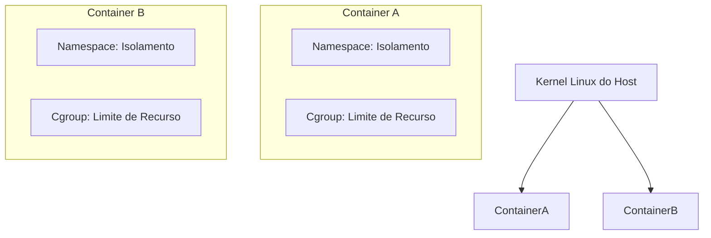
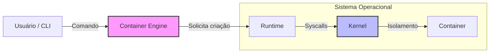
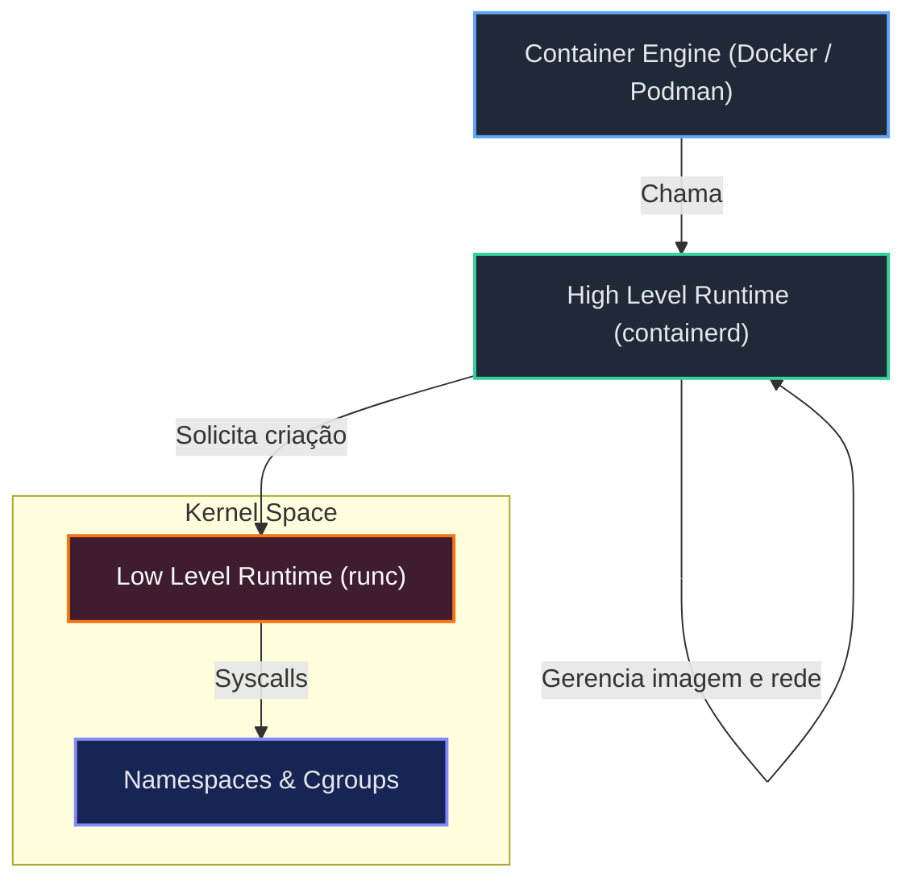
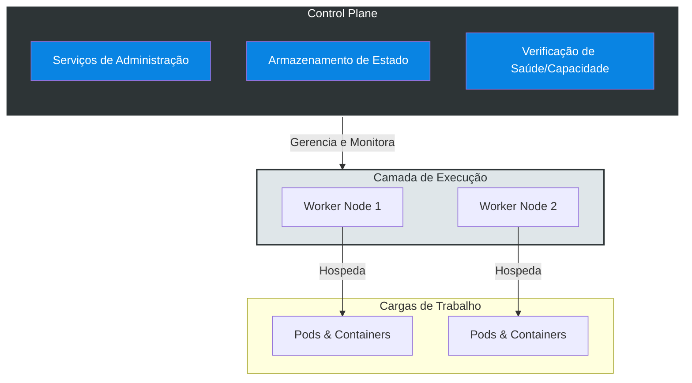
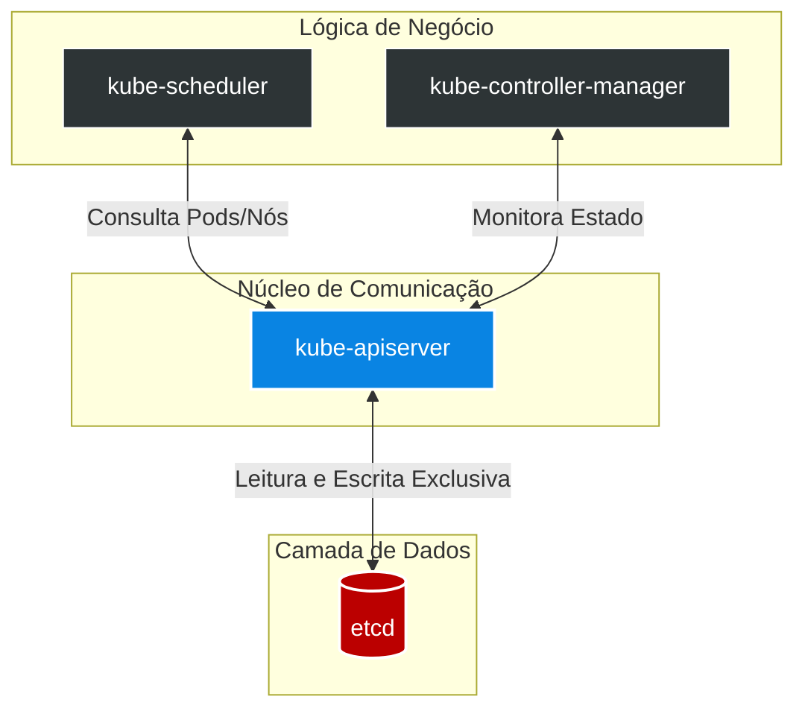
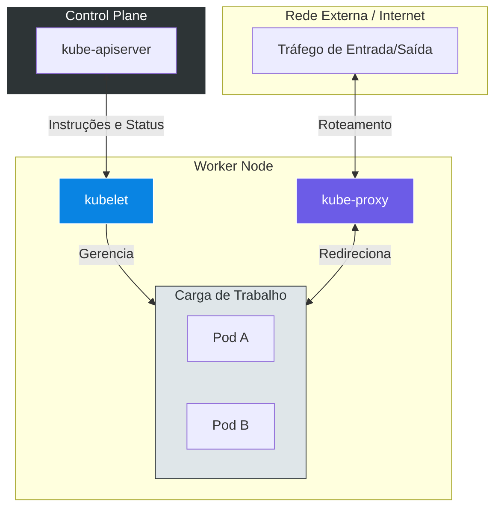
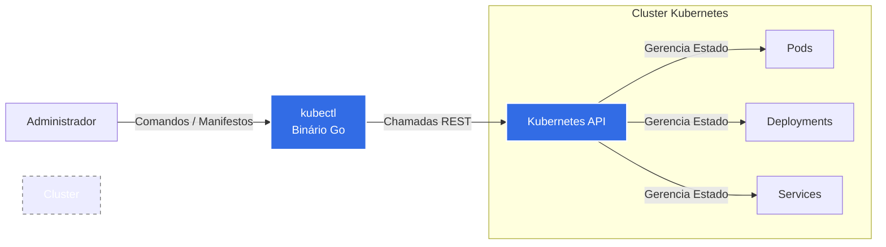
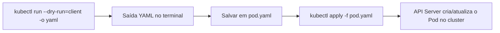

# Dia — Containers e Kubernetes

# Introdução aos Containers

## O que é um container?
Em resumo, container é **isolamento de recursos** no nível do sistema operacional. Ao contrário de máquinas virtuais, eles compartilham o mesmo kernel do host, mas mantêm o espaço de usuário separado.

### Quais recursos são isolados?
O isolamento garante que o container tenha sua própria visão de:
* **CPU e Memória** (Hardware)
* **Processos** (PID)
* **I/O e Rede**
* **Tabela de usuários**
* **Pontos de montagem** (Filesystem)

---

## Como isso é possível? (A "Mágica" do Kernel)
O isolamento não é uma ferramenta única, mas a combinação de módulos nativos do Kernel Linux:

| Tecnologia | Função Principal |
| :--- | :--- |
| **Cgroups** (Control Groups) | Responsável por **limitar e monitorar** o uso de recursos (Quanto de CPU/RAM o container pode usar). |
| **Namespaces** | Responsável pelo **isolamento de visão**. Garante que um processo não veja o que o outro está fazendo (Separa usuários, redes, mounts). |

### Visualizando a Arquitetura



---

## O que é um Container Engine?

Enquanto o Kernel fornece os recursos (Cgroups/Namespaces), o **Container Engine** é a camada de alto nível que gerencia o ciclo de vida da aplicação. Ele atua como um orquestrador local, preparando todo o terreno para a execução.

### Principais Responsabilidades
O Engine abstrai a complexidade de lidar com os recursos brutos, cuidando de:
* **Ciclo de vida:** Criação e destruição de containers.
* **Healthchecks:** Monitoramento da saúde da aplicação.
* **Volumes:** Persistência de dados e montagem de sistemas de arquivos.
* **Rede:** Criação de interfaces virtuais e pontes de comunicação.

> [!IMPORTANT]
> **Camada de Abstração**
> O Container Engine **não conversa diretamente com o Kernel**.
> Ele delega a execução de baixo nível para um *Container Runtime* (como o containerd ou runc). O Engine foca na experiência de uso e na API, não na chamada de sistema (syscall).

### Fluxo de Comunicação



---

## O que é um Container Runtime?

O **Container Runtime** é o componente responsável por executar os containers de fato. Ele atua como o intermediário que "conversa" com o Kernel para criar o isolamento e garantir que os processos estejam rodando.

### Classificação dos Runtimes

O ecossistema de containers divide os runtimes em três categorias principais, baseadas na proximidade com o Kernel:

| Tipo | Descrição | Exemplos |
| :--- | :--- | :--- |
| **High Level** | Executado pelo Container Engine. Gerencia o ciclo de vida, imagens e transfere a execução para o Low Level. **Não conversa diretamente com o Kernel.** | `containerd`, `CRI-O` |
| **Low Level** | O "operário". Conversa **diretamente com o Kernel** para configurar *Namespaces* e *Cgroups*. Ele cria o container e depois sai de cena. | `runc` (Padrão de mercado) |
| **Sandbox** | Focado em segurança extrema. Cria um Kernel "falso" ou uma micro-VM para cada container, garantindo isolamento total do Host. | `gvisor`, `Kata Containers` |

> ** Nota:** Na maioria dos setups modernos (como Kubernetes), o `containerd` (High Level) chama o `runc` (Low Level) para criar o container.

### A Camada de Execução Completa

Visualizando onde cada peça se encaixa:



---

## OCI - Open Container Initiative

A **OCI** é um projeto de estrutura de governança aberta, criado para padronizar o ecossistema de containers e evitar o *vendor lock-in* (dependência de um único fornecedor).

### Fundação e Membros
Foi fundada em 2015 por um consórcio de gigantes da tecnologia que decidiram unificar a forma como containers são criados e executados.
* **Membros Fundadores:** Docker, CoreOS, Google, IBM, Microsoft, Red Hat, VMware, entre outros.

### O Propósito (Padronização)
Antes da OCI, cada ferramenta tinha seu formato. A OCI criou especificações abertas para garantir que um container criado em uma ferramenta rodasse em qualquer outra.

| Especificação | O que define? |
| :--- | :--- |
| **Runtime Spec** | Como um "bundle" de filesystem deve ser descompactado e executado. |
| **Image Spec** | Como arquivar e transferir as imagens de container (o formato das *layers*). |

### O papel do `runc`
A OCI não ficou apenas no papel. Eles desenvolveram o **runc** como a implementação de referência das especificações.
* **Linguagem:** Desenvolvido em **Go (Golang)**.
* **Função:** É o runtime padrão que obedece às regras da OCI. É ele que o Docker e o Kubernetes usam "por baixo do capô" para falar com o Kernel.

---

## O que é o Kubernetes? (K8s)

O **Kubernetes**, frequentemente abreviado como K8s, é uma plataforma open-source portátil e extensível para o gerenciamento de cargas de trabalho e serviços containerizados. Ele facilita a configuração declarativa e a automação, atuando como um orquestrador que abstrai a infraestrutura subjacente (seja on-premise, nuvem pública ou híbrida).

## Visão Geral e Arquitetura

O Kubernetes opera sob um modelo de **estado desejado**. O operador define como o sistema deve se comportar (ex: "quero 3 réplicas deste serviço rodando"), e o "Control Plane" do Kubernetes trabalha continuamente para garantir que o **estado atual** da infraestrutura corresponda a esse estado desejado.

### Origem e Governança
Desenvolvido originalmente pelo Google entre 2014 e 2015, o projeto é o sucessor espiritual do sistema interno **Borg** (e posteriormente Omega). O Kubernetes foi escrito em **Go (Golang)** e doado para a **Cloud Native Computing Foundation (CNCF)**, onde se tornou o primeiro projeto graduado da organização.

> [!IMPORTANT]
> O Kubernetes não cria os containers diretamente. Ele orquestra a execução deles através de uma interface padronizada chamada **CRI (Container Runtime Interface)**, delegando a execução para runtimes compatíveis como containerd ou CRI-O.

## Funcionalidades Core

A principal função do Kubernetes é o agendamento (scheduling) e a distribuição de containers em um cluster de máquinas.

| Funcionalidade | Descrição Técnica |
| :--- | :--- |
| **Service Discovery & Load Balancing** | O K8s expõe containers usando nomes DNS ou endereços IP próprios. Se o tráfego for alto, ele realiza o balanceamento de carga para manter a estabilidade. |
| **Storage Orchestration** | Permite a montagem automática de sistemas de armazenamento, sejam locais, de provedores de nuvem (AWS EBS, GPD) ou soluções de rede (NFS, iSCSI). |
| **Automated Rollouts/Rollbacks** | Altera o estado atual para o estado desejado de forma controlada. Se algo falhar, o K8s realiza o rollback automático para a versão anterior. |
| **Self-healing** | Reinicia containers que falharam, substitui e reagenda containers quando nós morrem e mata containers que não respondem ao *health check* definido pelo usuário. |
| **Secret & Config Management** | Armazena e gerencia informações sensíveis (senhas, tokens OAuth, chaves SSH) e configurações de ambiente sem reconstruir as imagens dos containers. |

---

# Arquitetura do Kubernetes

O Kubernetes opera através de uma arquitetura de cluster distribuído, dividida fundamentalmente em duas categorias de componentes: a camada de gerenciamento (**Control Plane**) e a camada de execução de cargas de trabalho (**Workers**).

Esta separação de responsabilidades garante a escalabilidade, a alta disponibilidade e a organização lógica dos recursos do sistema.

## Control Plane

O **Control Plane** é a entidade responsável pelo controle global do cluster. Ele atua como o "cérebro" da operação, orquestrando decisões e mantendo o alinhamento entre o estado desejado e o estado atual do sistema.

Este nó (ou conjunto de nós) hospeda serviços e containers críticos administrativos que não estão relacionados à aplicação do usuário final, mas sim à infraestrutura do Kubernetes.

### Responsabilidades Primárias
Baseado nas definições de arquitetura, o Control Plane possui as seguintes atribuições mandatórias:

* **Gerenciamento de Saúde:** Monitoramento contínuo dos componentes do cluster.
* **Disponibilidade:** Garantia de que os serviços essenciais permaneçam acessíveis.
* **Gestão de Capacidade:** Avaliação e alocação de recursos computacionais.
* **Armazenamento de Estado:** Persistência de todos os dados de configuração e estado do cluster.

> [!WARNING]
> **Restrição de Execução**
> Por padrão, não é permitido executar aplicações de usuários (workloads) nos nós do Control Plane. Esta é uma medida de segurança e estabilidade para garantir que o consumo de recursos das aplicações não impacte os serviços críticos de gerenciamento do cluster.

## Worker Nodes

Os **Workers** são os nós de trabalho onde as aplicações efetivamente residem. É nesta camada que a carga de trabalho do usuário é processada.

Todos os **Pods** e **Containers** de aplicação são agendados e executados nestes nós, sob a supervisão das diretrizes estabelecidas pelo Control Plane.

## Comparativo de Componentes

A tabela abaixo detalha as distinções funcionais entre os dois tipos de nós no cluster.

| Componente | Função Principal | Tipo de Carga de Trabalho | Responsabilidade Crítica |
| :--- | :--- | :--- | :--- |
| **Control Plane** | Administração e Orquestração | Serviços do Sistema (System Containers) | Armazenar estado e garantir saúde do cluster. |
| **Worker** | Execução e Processamento | Aplicações do Usuário (Pods/Containers) | Rodar a aplicação final. |

## Diagrama de Arquitetura

O diagrama abaixo ilustra a relação hierárquica onde o Control Plane gerencia o estado e a saúde, enquanto os Workers executam as aplicações.


---

# Componentes do Control Plane

O Control Plane é composto por um conjunto de processos modulares que operam em sinergia para gerenciar o estado global do cluster Kubernetes. Cada componente possui uma responsabilidade específica na orquestração, armazenamento e tomada de decisões.

Abaixo estão detalhados os quatro componentes fundamentais baseados na arquitetura de referência.

## 1. etcd

O **etcd** atua como o banco de dados do cluster. É um armazenamento do tipo chave-valor (key-value store) consistente e de alta disponibilidade.

### Características Técnicas
* **Persistência de Estado:** É o único local onde o estado do cluster é armazenado definitivamente.
* **Topologia:** Pode ser hospedado diretamente em cada nó do Control Plane ou em um cluster externo dedicado.
* **Redundância:** Devido à sua natureza crítica, exige configuração de réplicas para garantir Alta Disponibilidade (HA).

> [!IMPORTANT]
> **Criticidade do Dados**
> Se o etcd for perdido ou corrompido, o estado do cluster é perdido. Backups regulares e arquitetura redundante são mandatórios para este componente.

## 2. kube-apiserver

O **kube-apiserver** é o componente central de comunicação ("hub"). Ele expõe a API do Kubernetes e atua como o "front-end" para o Control Plane.

### Funcionamento
* **Intermediário Exclusivo:** É o **único** componente que possui permissão para se comunicar diretamente com o **etcd**.
* **Centralização:** Coleta o status de todos os componentes do cluster e centraliza os eventos.
* **Fluxo de Dados:** Recebe requisições, valida e persiste as informações no etcd. Nenhum outro componente acessa o banco de dados sem passar pelo API Server.

## 3. kube-scheduler

O **kube-scheduler** é responsável pelo planejamento e agendamento de cargas de trabalho. Ele decide em qual nó (Worker) um novo Pod deve ser executado.

### Critérios de Decisão
* **Capacidade:** Analisa os recursos disponíveis (CPU/Memória) nos nós.
* **Provisionamento:** Além de agendar Pods, auxilia na criação de volumes.
* **Comunicação:** Consulta constantemente o kube-apiserver para identificar Pods que ainda não foram atribuídos a um nó.

## 4. kube-controller-manager

O **kube-controller-manager** é um daemon que incorpora os loops de controle principais do Kubernetes. Sua função é observar o estado atual e trabalhar para atingir o estado desejado.

### Gerenciamento de Controladores
Ele atua como o "gerente" de diversos controladores específicos, incluindo:
* **Node Controller:** Monitora a saúde dos nós.
* **Deployment Controller:** Gerencia a implementação de aplicações.
* **ReplicaSet Controller:** Garante o número correto de réplicas de um Pod.
* **Pod Controller:** Assegura a integridade do ciclo de vida dos Pods.

## Resumo dos Componentes

| Componente | Função Primária | Dependência Crítica |
| :--- | :--- | :--- |
| **etcd** | Armazenamento de Estado (Banco de Dados) | Requer Alta Disponibilidade. |
| **kube-apiserver** | Comunicação e API Gateway | Único com acesso ao etcd. |
| **kube-scheduler** | Decisão de Alocação (Scheduling) | Depende da capacidade dos nós. |
| **kube-controller-manager** | Manutenção do Estado Desejado | Gerencia múltiplos sub-controladores. |

## Fluxo de Comunicação do Control Plane

O diagrama abaixo ilustra a arquitetura centralizada no API Server e o isolamento do etcd.


---

# Componentes dos Worker Nodes

Os Worker Nodes são as máquinas (físicas ou virtuais) onde as cargas de trabalho do Kubernetes são efetivamente executadas. Para que um nó possa receber Pods e ser gerenciado pelo cluster, ele deve executar obrigatoriamente os agentes locais descritos abaixo.

## 1. kubelet

O **kubelet** é o principal agente do Kubernetes que roda em cada nó do cluster. Ele atua como o "capitão" do nó, garantindo que os containers descritos nos PodSpecs estejam rodando e saudáveis.

### Responsabilidades
* **Registro de Nó:** Registra o nó junto ao Control Plane, tornando-o disponível para agendamento.
* **Gerenciamento de Ciclo de Vida:** Recebe instruções do **kube-apiserver** e interage com o Container Runtime (ex: Docker, containerd) para iniciar ou parar containers.
* **Monitoramento de Saúde:** Verifica continuamente se os containers estão vivos e prontos (Liveness e Readiness Probes) e reporta o status ao Control Plane.

> [!NOTE]
> **Cardinalidade**
> Existe exatamente uma instância do kubelet rodando em cada nó do cluster. Se o kubelet parar, o Control Plane considera o nó como "NotReady" e para de enviar novos Pods para ele.

## 2. kube-proxy

O **kube-proxy** é um componente de rede que roda em cada nó do cluster. Ele é responsável por manter as regras de rede no host e permitir a comunicação dos Pods.

### Responsabilidades
* **Abstração de Rede:** Gerencia a comunicação entre os Pods e o "mundo exterior" (internet ou redes externas), bem como a comunicação entre serviços dentro do cluster.
* **Roteamento de Tráfego:** Implementa o encaminhamento de pacotes TCP e UDP.
* **Balanceamento de Carga:** Atua na distribuição básica de tráfego para os serviços do Kubernetes.

## Tabela de Funções do Worker

A tabela abaixo diferencia as responsabilidades de execução (Compute) das responsabilidades de comunicação (Network).

| Componente | Categoria | Função Principal | Interação Chave |
| :--- | :--- | :--- | :--- |
| **kubelet** | Computação / Execução | Garantir que containers estejam rodando e saudáveis. | Conversa com **kube-apiserver**. |
| **kube-proxy** | Rede (Networking) | Permitir comunicação dos Pods com redes externas e internas. | Gerencia regras de IP/Porta. |

## Fluxo de Interação no Worker Node

O diagrama abaixo ilustra como os componentes locais interagem com o Control Plane e com o tráfego externo.


---

# Requisitos de Rede e Portas

A comunicação correta entre os componentes do Kubernetes depende estritamente da liberação de portas específicas nos firewalls ou grupos de segurança (Security Groups) da infraestrutura.

Abaixo estão listadas as portas padrão para o **Control Plane**, **Worker Nodes** e plugins de rede (**CNI**).

## 1. Control Plane (Mestre)

Estas portas devem estar acessíveis para permitir a administração do cluster e a comunicação interna dos componentes de controle.

| Protocolo | Porta | Componente | Descrição | Origem/Destino |
| :--- | :--- | :--- | :--- | :--- |
| **TCP** | `6443` | **kube-apiserver** | Porta da API do Kubernetes. | Todos (Interno/Externo) |
| **TCP** | `2379` - `2380` | **etcd** | API de Cliente e Comunicação entre pares (peers). | `kube-apiserver` e outros nós etcd |
| **TCP** | `10251` | **kube-scheduler** | API do agendador. | Localhost (Self) / Control Plane |
| **TCP** | `10252` | **kube-controller-manager** | API do gerenciador de controladores. | Localhost (Self) / Control Plane |

## 2. Worker Nodes (Trabalhadores)

Estas portas são utilizadas pelos serviços que rodam nos nós de trabalho e para a exposição de aplicações.

| Protocolo | Porta | Componente | Descrição | Origem/Destino |
| :--- | :--- | :--- | :--- | :--- |
| **TCP** | `10250` | **kubelet** | API do Kubelet (Agente do nó). | Control Plane |
| **TCP** | `30000` - `32767` | **NodePort Services** | Intervalo padrão para serviços do tipo NodePort. | Todos (Tráfego Externo) |

## 3. Plugins de Rede (CNI)

As portas abaixo dependem da escolha da interface de rede (CNI) utilizada no cluster. A configuração incorreta destas portas impede a comunicação entre Pods de nós diferentes.

### Weave Net (Wavenet)
| Protocolo | Porta | Descrição |
| :--- | :--- | :--- |
| **TCP** | `6783` | Porta de controle do Weave Net. |
| **UDP** | `6783` - `6784` | Tráfego de dados e encapsulamento (VXLAN). |

### Calico
| Protocolo | Porta | Descrição |
| :--- | :--- | :--- |
| **TCP** | `179` | **BGP** (Border Gateway Protocol). Necessário se o roteamento BGP estiver ativado. |
| **UDP** | `8472` | **VXLAN**. Necessário para o encapsulamento de pacotes entre nós. |

> [!IMPORTANT]
> **Configuração de Firewall para CNI**
> Ao utilizar o **Calico**, certifique-se de liberar o tráfego UDP na porta `8472` para garantir a funcionalidade da rede overlay (VXLAN). Se optar pelo roteamento via **BGP**, a porta TCP `179` é mandatória.
---

# Objetos Fundamentais: Workloads e Services

No Kubernetes, a gestão de aplicações não é feita apenas executando containers isolados. O sistema utiliza uma hierarquia de objetos para garantir escalabilidade, persistência e acessibilidade.

Abaixo detalhamos os três pilares principais: **Pods** (Unidade), **Controllers** (Gerenciamento) e **Services** (Rede).

## 1. Pod

O **Pod** é a menor unidade de gerenciamento e execução dentro do Kubernetes. O sistema não gerencia containers diretamente; ele gerencia Pods.

### Características Técnicas
* **Unicidade:** Cada Pod recebe um endereço IP único dentro do cluster.
* **Multi-Container:** Um Pod pode encapsular um ou mais containers (ex: aplicação principal + sidecar de log).
* **Contexto Compartilhado:** Todos os containers dentro do mesmo Pod compartilham:
    * O mesmo endereço IP e portas (comunicam-se via `localhost`).
    * Os mesmos volumes de armazenamento montados.
    * O mesmo ciclo de vida (nascem e morrem juntos).

## 2. Controllers: Deployment e ReplicaSet

Para garantir que os Pods permaneçam rodando conforme o esperado, utilizamos controladores. Eles monitoram o estado atual e trabalham para atingir o estado declarado.

### Deployment
O **Deployment** é o controlador de nível superior responsável pela gestão declarativa da aplicação.
* **Função:** Define o estado desejado (imagem, recursos, variáveis).
* **Estratégia de Atualização:** Quando um Deployment é editado (ex: troca de versão da imagem), ele cria um **novo ReplicaSet** e escala o antigo para zero gradualmente.
* **Rollback:** Permite reverter para uma versão anterior simplesmente reativando o ReplicaSet antigo que foi desativado.

### ReplicaSet
O **ReplicaSet** é o "braço direito" do Deployment.
* **Função:** Sua única responsabilidade é garantir a **quantidade exata de réplicas** (cópias do Pod) em execução.
* **Automação:** Sempre que um Deployment é criado, um ReplicaSet é gerado automaticamente para gerenciar os Pods daquela versão.

> [!NOTE]
> **Abstração**
> Na prática, você quase nunca cria um ReplicaSet ou um Pod manualmente. Você cria um **Deployment**, e ele gerencia o ReplicaSet, que por sua vez gerencia os Pods.

---

## 3. Service

Como os Pods são efêmeros (podem ser destruídos e recriados com novos IPs), o **Service** atua como uma abstração de rede estável para expor a aplicação.

O Service garante que o tráfego seja roteado para os Pods corretos, independentemente de onde eles estejam rodando ou de qual seja o IP atual deles.

### Tipos de Service

| Tipo | Visibilidade | Descrição |
| :--- | :--- | :--- |
| **ClusterIP** | Interna | Padrão. Expõe o serviço apenas dentro do cluster. Acessível apenas por outras aplicações internas. |
| **NodePort** | Externa (Estática) | Abre uma porta física (range 30000-32767) em **cada nó** do cluster. Permite acesso externo via `<IP-do-No>:<Porta>`. |
| **LoadBalancer** | Externa (Dinâmica) | Provisiona um balanceador de carga nativo do provedor de nuvem (AWS, Azure, GCP) e atribui um IP público fixo. |

---

## Arquitetura de Relacionamento

O diagrama abaixo ilustra a cadeia de responsabilidade: do Deployment até a exposição via Service.

ADD IMAGE < >
---

# Entendendo o kubectl

## Visão Geral

O **kubectl** é a interface de linha de comando (CLI) fundamental para a administração de clusters **Kubernetes**. É a partir desta ferramenta que o administrador orquestra a infraestrutura, sendo responsável por declarar e gerenciar o estado dos recursos no cluster.

## Detalhamento Técnico e Instalação

Sob o capô, o `kubectl` atua como um cliente HTTP que estabelece comunicação direta com o control plane do cluster, interagindo especificamente com a **Kubernetes API** (`kube-apiserver`). Ao receber um comando imperativo ou declarativo, a ferramenta serializa os dados e os envia como requisições REST para a API.

> [!NOTE]  
> A instalação do `kubectl` é notavelmente simples por se tratar de um binário único compilado em **Go (Golang)**. Isso garante alta portabilidade entre diferentes sistemas operacionais (Linux, macOS, Windows) sem a necessidade de gerenciar dependências complexas.

## Capacidades de Gerenciamento

Através da comunicação com a API, o administrador utiliza o `kubectl` para provisionar e gerenciar a base de qualquer aplicação no Kubernetes. A tabela abaixo resume os principais recursos:

| Recurso | Função no Cluster |
| :--- | :--- |
| **Pods** | A menor unidade computacional implantável do cluster. O `kubectl` instrui a API a agendar e executar os containers contidos neles. |
| **Deployments** | Estruturas que definem o estado desejado para as aplicações. O `kubectl` é utilizado para criar, atualizar ou escalar o número de réplicas. |
| **Services** | Abstrações lógicas que expõem aplicações rodando em um ou mais Pods na rede. Criados via `kubectl` para garantir roteamento e balanceamento. |

> [!IMPORTANT]  
> O `kubectl` não executa cargas de trabalho nem aloca recursos diretamente. Sua função exclusiva é interagir com a API, enviando instruções. É o control plane do Kubernetes que recebe essas instruções e trabalha para que o estado atual do cluster corresponda ao estado solicitado pelo administrador.

## Arquitetura de Comunicação

O diagrama abaixo ilustra o fluxo de requisição, desde o terminal do administrador até a efetivação dos recursos no cluster Kubernetes:


---

# Primeiros Passos no Kubernetes com kubectl

A ferramenta de linha de comando **kubectl** atua como o cliente primário para interação com a API do **Kubernetes**. O comando fundamental para leitura e inspeção do estado atual da infraestrutura e das aplicações é o `get`, responsável por consultar e retornar a lista de recursos alocados.

## Referência de Comandos Básicos
Abaixo está o detalhamento dos comandos primários para mapeamento do ambiente.

### Comandos `kubectl get` (unificado)

| Comando | Escopo de Execução | Descrição Técnica |
| --- | --- | --- |
| `kubectl get nodes` | Nível de Cluster | Lista todos os nós de processamento registrados e ativos na topologia do cluster. |
| `kubectl get namespaces` | Nível de Cluster | Lista todos os isolamentos lógicos e ambientes virtuais particionados dentro do cluster. |
| `kubectl get pods` | Namespace (default) | Lista as unidades de computação fundamentais contendo os containers no namespace padrão. |
| `kubectl get deployments` | Namespace (default) | Lista os controladores de implantação de estado desejado presentes no namespace padrão. |
| `kubectl get service` | Namespace (default) | Lista as políticas de roteamento de rede e abstrações de acesso no namespace padrão. |
| `kubectl get replicaset` | Namespace (default) | Lista os controladores que garantem a disponibilidade de um número específico de réplicas de Pods no namespace padrão. |
| `kubectl get pods -A` | Todos os Namespaces | Executa uma listagem de todos os Pods em execução, consolidando a saída de todos os namespaces. |
| `kubectl get deployments -A` | Todos os Namespaces | Lista todos os Deployments configurados em toda a topologia do cluster. |
| `kubectl get service -A` | Todos os Namespaces | Mapeia todos os Services (políticas de roteamento e descoberta) operantes em todos os namespaces. |
| `kubectl get replicaset -A` | Todos os Namespaces | Lista todos os ReplicaSets responsáveis pela garantia de réplicas em toda a extensão do ambiente. |
| `kubectl get pods -n kube-system` | Namespace `kube-system` | Solicita e lista todos os Pods estritamente contidos na partição lógica do sistema (`kube-system`). |
| `kubectl get pods -n kube-system -o wide` | Namespace `kube-system` | Retorna a lista de Pods do sistema enriquecida com colunas vitais de infraestrutura: IP (endereçamento do container), Node (nó hospedeiro), `nominated-node` e status de readiness gates. |

> [!IMPORTANT]  
> O comportamento padrão da API do Kubernetes ao receber chamadas para recursos conteinerizados (como Pods, Deployments e Services) é consultar estritamente o ambiente `default`. Para visualizar componentes de sistema ou aplicações isoladas, modificadores de escopo devem ser aplicados à instrução original.

> [!NOTE]
> A flag de formatação estendida (-o wide) é essencial no processo de troubleshooting de rede, pois expõe instantaneamente em qual máquina o processo está alocado e qual IP foi distribuído pelo CNI (Container Network Interface).

## Tabela de Referência de Comandos

| Comando Executado | Ação Realizada | Parâmetros Técnicos |
| :--- | :--- | :--- |
| `kubectl run --image nginx --port 80 nginx` | Provisiona um novo Pod chamado "nginx". | `--image`: Define a imagem OCI alvo. <br> `--port`: Expõe a porta no nível do container. |
| `kubectl exec -it nginx -- bash` | Abre uma sessão de terminal interativa com o shell bash. | `-i`: Mantém o STDIN aberto. <br> `-t`: Aloca um pseudo-TTY. |
| `kubectl exec -it nginx -- ls /proc` | Executa um comando único e retorna o output para o terminal local. | `--`: O duplo traço sinaliza o fim dos argumentos do kubectl e o início do comando do container. |
| `kubectl exec -it nginx --container nginx -- bash` | Abre uma sessão bash explicitando o container alvo. | `--container`: Especifica o container exato para a execução do comando. |

---

# Exclusão de Cargas de Trabalho no Kubernetes

## O Ciclo de Vida de Deleção

A exclusão de um **Pod** no Kubernetes não é uma operação imediata e abrupta, mas sim um processo orquestrado de encerramento. A utilização do utilitário cliente **kubectl** para deletar recursos garante que o cluster inicie um fluxo de desligamento controlado, permitindo que as aplicações finalizem requisições ativas e salvem estados em memória antes da destruição do container.

## Detalhamento Técnico: O Fluxo de Término

Quando o comando de deleção é invocado, o cliente emite uma requisição HTTP do tipo `DELETE` para o **Kubernetes API Server**. O servidor não destrói o recurso imediatamente; em vez disso, ele atualiza o registro do Pod no banco de dados distribuído inserindo um `deletionTimestamp` (carimbo de tempo de exclusão) e configurando um período de carência (Grace Period).

O **Kubelet** em execução no nó hospedeiro detecta essa mudança de estado e inicia o processo de encerramento por meio da **Container Runtime Interface (CRI)**. O runtime envia um sinal de interrupção (`SIGTERM`) ao processo principal (PID 1) do container. Se o processo não for finalizado dentro do período de carência padrão (geralmente 30 segundos), um sinal de aniquilação (`SIGKILL`) é emitido, forçando o encerramento agressivo no nível do Kernel do sistema operacional.

## Tabela de Componentes do Comando

| Parâmetro/Comando | Tipo | Descrição Técnica |
| :--- | :--- | :--- |
| `kubectl` | Binário Cliente | Utilitário que traduz a instrução do terminal em chamadas REST autenticadas para a API do cluster. |
| `delete` | Operação | Especifica o verbo HTTP (`DELETE`) para interagir com o estado declarativo do recurso. |
| `pods` | Tipo de Recurso | Define a coleção da API do Kubernetes que será acessada (também pode ser referenciada pelo atalho `po`). |
| `nginx` | Identificador | O nome exato da instância a ser localizada e marcada para encerramento no namespace atual. |

---

# Otimização de Produtividade na CLI do Kubernetes

## Introdução à Eficiência Operacional

A administração diária de clusters Kubernetes exige a execução repetitiva de comandos de inspeção e mutação de estado através do binário cliente. Para mitigar a verbosidade inerente da ferramenta de linha de comando, é prática padrão da indústria implementar otimizações no nível do interpretador de comandos (shell) e utilizar o mapeamento interno de recursos provido nativamente pela API.

## Detalhamento Técnico: Interceptação e Descoberta

A otimização de comandos ocorre em duas camadas distintas de execução. Na camada do sistema operacional, o utilitário **Alias** do shell atua como um interceptador léxico em memória, traduzindo o atalho `k` para a chamada real do binário `kubectl` antes de repassar os argumentos.

Na camada do cliente Kubernetes, o binário implementa um mecanismo de resolução de nomes curtos (short names). Durante a comunicação inicial com o **Kubernetes API Server**, o cliente consome os endpoints da Discovery API para obter o mapa de recursos suportados. Isso permite traduzir as abreviações inseridas no terminal em entidades **GVK** (Group, Version, Kind) completas, montando a requisição REST correta para a coleção da API adequada (por exemplo, traduzindo `po` para `/api/v1/namespaces/{namespace}/pods`).

## Tabela de Mapeamento de Recursos Essenciais

| Recurso (Kind) | Abreviação (Short Name) | Função Arquitetural no Cluster |
| :--- | :--- | :--- |
| `pods` | `po` | Menor unidade de computação implantável; encapsula os containers e compartilha namespaces IPC/Network. |
| `deployments` | `deploy` | Controlador de estado declarativo; gerencia a escalabilidade, atualização e reversão de ReplicaSets. |
| `services` | `svc` | Abstração de rede; provê roteamento, DNS interno e balanceamento de carga estável para os Pods. |

---

# Kubectl dry-run e geração de YAML

## Definição macro

O `--dry-run` no `kubectl` permite **simular** uma operação sem persistir mudanças no cluster. Na prática, você usa isso para **gerar manifests YAML** rapidamente e então aplicar esses manifests de forma controlada.

> [!NOTE]
> No contexto do `kubectl`, `dry-run` significa: o comando monta o objeto (com validações locais, quando aplicável), mas **não cria/atualiza recursos no cluster**.

## Como funciona tecnicamente

O fluxo típico é:

1. `kubectl run ... --dry-run=client -o yaml` constrói localmente o objeto (ex: um Pod) e imprime o manifest em YAML.
2. Você salva esse YAML em arquivo (ex: `pod.yaml`).
3. `kubectl apply -f pod.yaml` envia o manifest ao cluster para criação/atualização do recurso.

### Gerar YAML sem criar o Pod
```bash
kubectl run --image nginx --port 80 nginx --dry-run=client -o yaml > pod.yaml
```

```yaml
apiVersion: v1
kind: Pod
metadata:
  labels:
    run: nginx
  name: nginx
spec:
  containers:
  - image: nginx
    name: nginx
    ports:
    - containerPort: 80
    resources: {}
  dnsPolicy: ClusterFirst
  restartPolicy: Always
status: {}
```

### Modos de dry-run

| Modo | Onde ocorre a simulação | Efeito prático |
| --- | --- | --- |
| `--dry-run=client` | Cliente (sua máquina) | Gera o objeto e imprime/valida localmente, sem falar com o cluster para criar o recurso |
| `--dry-run=server` | API Server | Envia para validação no servidor, mas não persiste o objeto |

> [!IMPORTANT]
> No seu exemplo, `--dry-run=client` é ideal para gerar YAML rapidamente e versionar no Git.

### Diagrama do fluxo


### Fluxo de trabalho recomendado
| Etapa          | Comando                                               | Objetivo                                        |
| -------------- | ----------------------------------------------------- | ----------------------------------------------- |
| Gerar manifest | `kubectl run ... --dry-run=client -o yaml > pod.yaml` | Criar base do YAML sem impacto no cluster       |
| Revisar/editar | editar `pod.yaml`                                     | Ajustar labels, probes, resources, etc.         |
| Aplicar        | `kubectl apply -f pod.yaml`                           | Criar/atualizar no cluster de forma declarativa |
